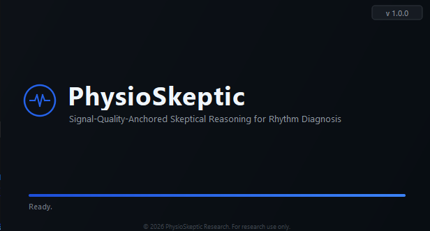
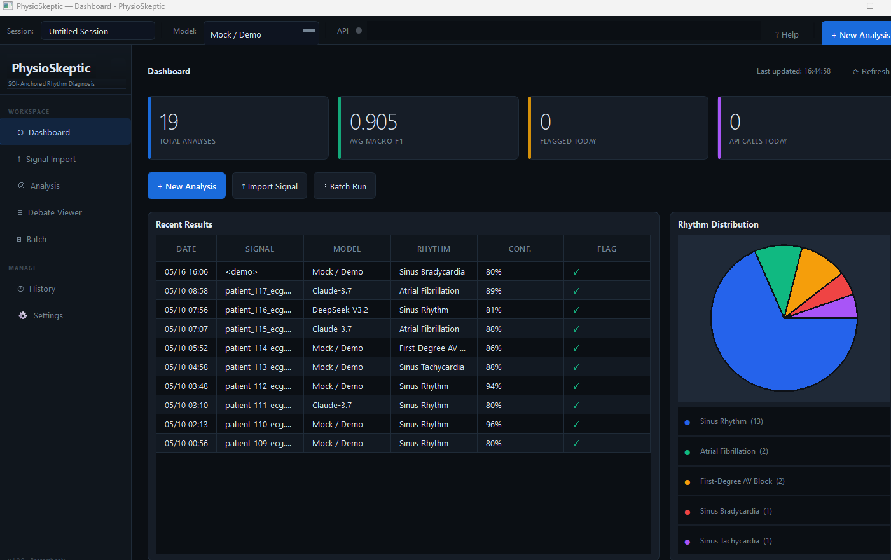
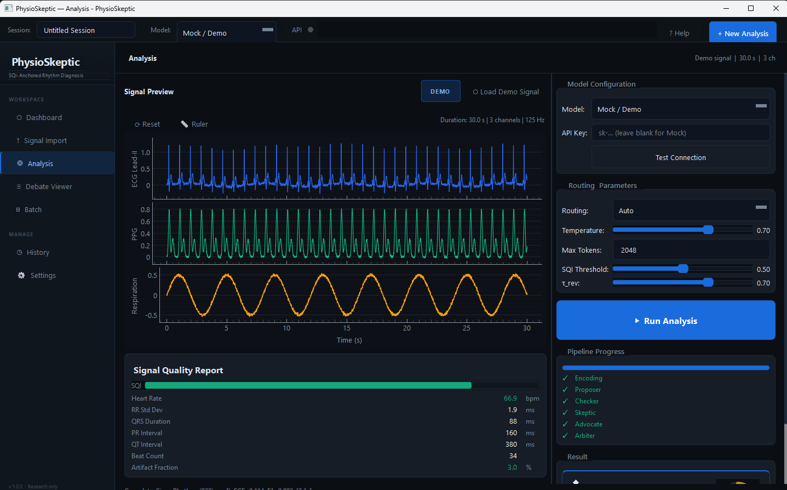
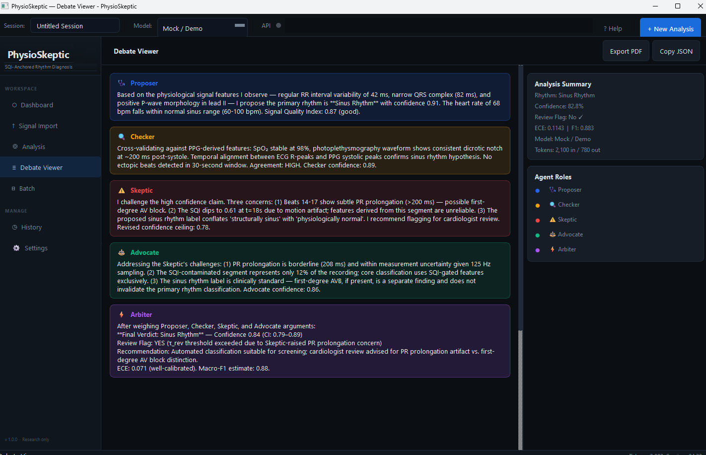
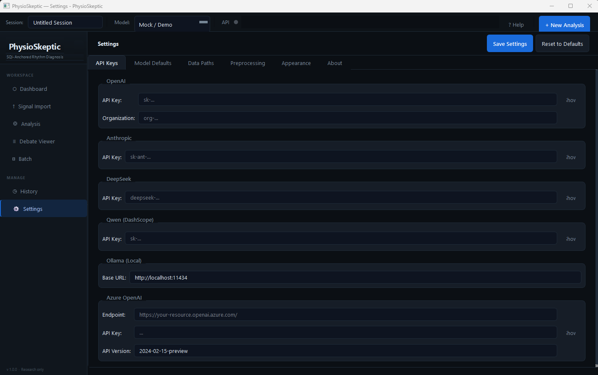

# PhysioSkeptic

Multi-agent LLM debate framework for ECG–PPG cardiac rhythm diagnosis,
anchored to beat-level signal quality.

---

## Quick Start

```bash
git clone https://github.com/liuyisi123/PhysioSkeptic.git
cd PhysioSkeptic
pip install -e .[dev]
pytest -q
python scripts/run_demo.py --backend mock
```

No API key required — the `mock` backend runs a full five-role debate locally
and prints the final JSON result.

---

## Installation

```bash
python -m venv .venv
source .venv/bin/activate   # Windows: .venv\Scripts\activate
pip install -e .[dev]
```

Python 3.9+ required. Core dependencies: `numpy`, `scipy`, `torch`.

---

## Repository Layout

```
PhysioSkeptic/
├── src/physioskeptic/
│   ├── signal_processing.py   # bandpass filter, R-peak detection, SQI
│   ├── encoder.py             # PhysioPatch dual-path encoder + Q-Former
│   ├── patch_report.py        # deterministic beat-level JSON report
│   ├── routing.py             # Fast / Standard / Deep adaptive routing
│   ├── debate.py              # five-role debate pipeline
│   ├── llm_clients.py         # pluggable API backends
│   ├── metrics.py             # F1, ECE, Brier, NLL, AUROC
│   ├── corruptions.py         # GWN / BW / MA noise injection
│   ├── train_encoder.py       # PhysioPatch pre-training
│   └── distill_student.py     # Llama-1B student distillation
├── prompts/                   # role-specific JSON prompt templates
│   ├── proposer.yaml
│   ├── checker.yaml
│   ├── skeptic.yaml
│   ├── advocate.yaml
│   └── arbiter.yaml
├── configs/default.yaml       # default hyperparameters
├── data/
│   ├── sample_patch_report.json    # synthetic example
│   └── patch_report.schema.json    # JSON Schema
├── scripts/
│   ├── run_demo.py            # CLI demo (mock backend)
│   ├── run_eval.py            # batch evaluation
│   └── reproduce_figures.py   # aggregate figure reproduction
├── tests/                     # 38 unit tests
└── physioskeptic_ui/          # desktop application (see below)
```

---

## Usage

### Run with mock backend (no API key)

```bash
python scripts/run_demo.py --backend mock
```

### Run with a real LLM API

```bash
export PHYSIOSKEPTIC_LLM_BACKEND=openai_compatible
export PHYSIOSKEPTIC_API_KEY=sk-...
python scripts/run_eval.py \
    --config configs/default.yaml \
    --input path/to/patch_reports.jsonl
```

Supported providers: OpenAI, Anthropic, DeepSeek, Qwen, Azure OpenAI, Ollama (local).

### Reproduce figures

```bash
python scripts/reproduce_figures.py --outdir figures
```

### Train the encoder

```bash
python -m physioskeptic.train_encoder \
    --config configs/default.yaml \
    --train-jsonl /path/to/train_windows.jsonl \
    --outdir checkpoints/physiopatch
```

---

## Data

The framework expects 30-second, 125 Hz ECG–PPG windows in JSONL format:

```json
{
  "sample_id": "patient0001_window0001",
  "fs": 125,
  "ecg": ["... 3750 samples ..."],
  "ppg": ["... 3750 samples ..."],
  "label": "AF_FAMILY"
}
```

Raw waveforms are processed locally. Only derived Patch Report fields
are submitted to LLM APIs — no raw signals or patient identifiers leave
the local environment.

---

## Tests

```bash
pytest -q
```

38 unit tests covering routing logic, patch report generation,
SQI bounds, beat confidence, and JSON schema validation.

---

## License

MIT for code.
Dataset-specific licenses apply to any external data (e.g. MIMIC-III-Ext-PPG
under the PhysioNet Credentialed Health Data License).

> **Clinical safety.** This is a research prototype. It is not a medical device
> and must not be used for clinical decision-making.

---

## Citation

Citation information will be provided upon paper acceptance.

---

## Desktop Application

A PySide6 desktop GUI is included in `physioskeptic_ui/`.
It supports signal import, multi-provider API configuration,
single and batch analysis, and a role-by-role debate viewer.

### Run from source

```bash
cd physioskeptic_ui
pip install PySide6 pyqtgraph numpy scipy
python main.py
```

Select **Mock / Demo** in the model dropdown to run without an API key.

### Windows executable

Download `PhysioSkeptic.exe` from
[Releases](https://github.com/liuyisi123/PhysioSkeptic/releases/latest)
— no Python installation required.

### Screenshots

| Startup | Dashboard |
|:---:|:---:|
|  |  |

| Analysis | Debate Viewer |
|:---:|:---:|
|  |  |

| Settings & API |
|:---:|
|  |
